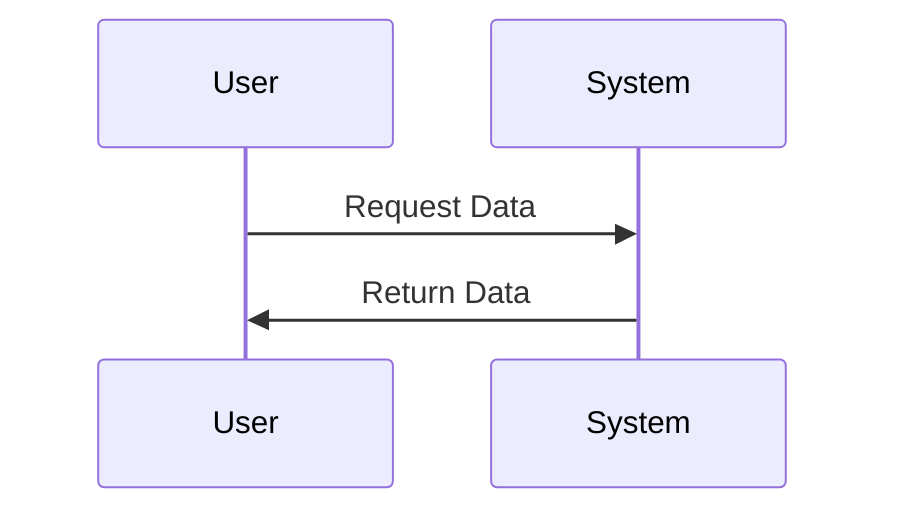

# Sequenced Alerts

## Table of Contents
- [Overview](#overview)
- [Installation](#installation)
- [Usage](#usage)
- [Features](#features)
- [Diagrams](#diagrams)
- [License](#license)

## Overview
Sequenced Alerts is a watch app meant to aide in segmenting a day into smaller portions. The user selects a sequence of alert they would like to follow for the day. The user can save patterns for days that they liked and recall those days as an option based on the day of the week. 

## Installation
Open the Garmin Connect application on your mobile device or navigate to garmin using your preferred browser.

### Deploying Watch App app
1. Run build for Device on Venu2,
2. Move the PRG to Windows OS,
3. Move the .prg file into the garmin/app folder,
4. Disconnect device and allow for the app to be verified.

### Available for select devices
* Venu 2

## Usage
1. Open the application on one of the supported devices,
2. Select your mode from the main menu,
3. Go about your activity, the timer will alert you when you are ready to switch.

If you want to stop that is an option from the alert screen.

## Features
| Feature | Description | Status |
|---------|-------------|--------|
| Start | Initalization for all new Users | ✅ |
| Settings | Options for making adjustments to the vibration settings and duration | 🚧 |
| Timer | The screen that shows the timer and activity | 🚧 |
| Repeat | Replay the alerts used on the previous day | 🚧 |
| Typical | Repeats the most commonly used on that day of the week | 🚧 |
| Alerts | The screen that shows when the timer has run out | 🚧 |

### Sub-Features
Main Menu:
- Start
  - User selects an activity and limit, 15 minute intervals
  - Timer screen appears
- Repeat
  - Repeats the same activity and intervals from the previous day
- Typical
  - Looks at the day of the week and repeats similar activity and intervals
- Settings
  - Vibration 
    - duration
    - confirm
- Timer
  - Countdown
  - Not always on display
  - Cancel button
  - Activity label
- Alerts
  - Next activity
  - Next interval
  - Extend activity

## Diagrams
Sequence diagram:

## Definitions
Interval
: Measured in seconds going up to 5, 10, 15 minutes
60*5

Activity
: A representation of what the user might be doing inbetween alerts

## Task Lists
- [x] Create the project
- [ ] Deploy sample application to watch
- [ ] Research testing

## License
This project is licensed under the [MIT License](https://opensource.org/licenses/MIT).

## Contact
- Email: [example@example.com](mailto:example@example.com)

---

© 2025 Sequence Alerts. All rights reserved.

---
